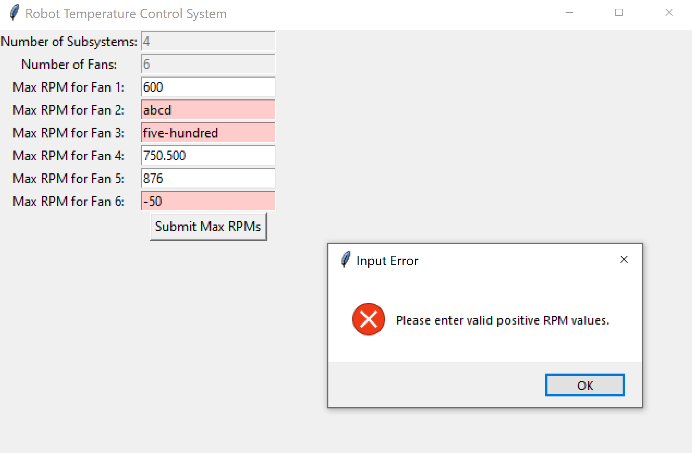
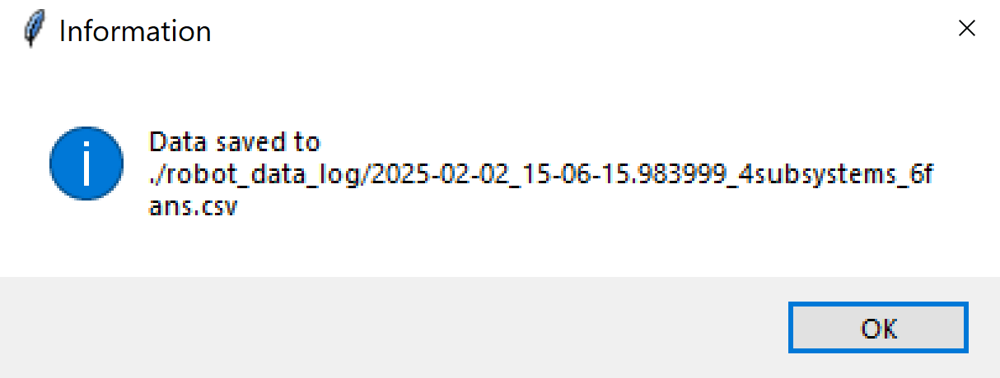
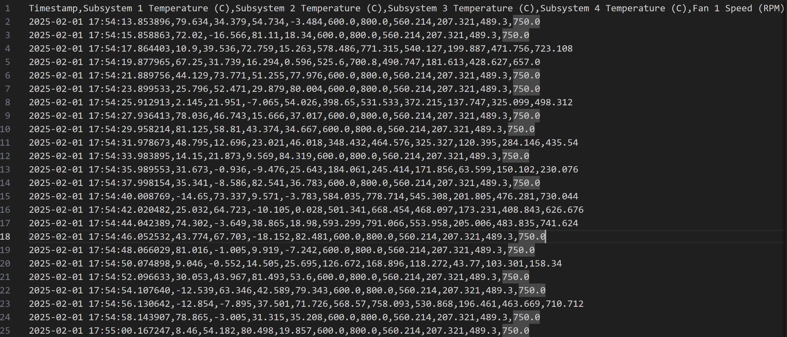
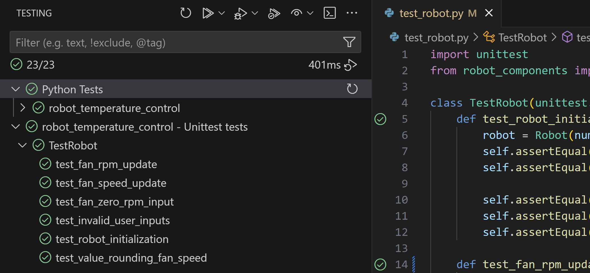

# Robot Temperature Control

## Overview
### Introduction
This is a programming project that monitors a robot with multiple subsystems and cooling fans. The robot dynamically adjusts the speed of its cooling fans based on the highest detected temperature. The system is designed using Object-Oriented Programming (OOP) in Python to ensure scalability and maintainability.

I identified key goals that tie into the prompt objective and to a real-world software engineer in manufacturing:
- Implement a clean and well-structured Object-Oriented Programming (OOP) design.
- Show that the robot accurately works for ranges of temperatures from -20°C to 85°C, which aligns with typical operating conditions for various robotic components as referenced [here](https://www.sciencedirect.com/science/article/pii/S1359431118303867)). However, the specific temperature range for any given robot will depend on its unique application, environmental conditions, and component specifications.
- Write tests to confirm the system's robustness and reliability. 

### System Behavior & Expectations
- The maximum temperature of all the subsystems determines the fan speeds, where all fans are set to the same percentage of their individual max speeds. 
    - All fans run at:
        - 20% max RPM when maximum subsystem temperature is 20°C and below
        - 100% max RPM when maximum subsystem temperature is 75°C and above
        - Linearly interpolated when in between 20°C and 75°C
- Temperatures and fan speeds are reported up to the third decimal. 
- The subsystem temperatures will be updated every 2 seconds.
- As mentioned in motivations, our goal is to see how the fans of the robot reacts across a broad range of subsystem temperatures. Thus, the user can expect the subsystem temperatures to be random values between 
-20°C and 85°C. The corresponding fan RPMs will be adjusted accordingly, providing a real-time response to the changing temperatures.
- The application logs system state data in a csv file created after each program run in the `robot_data_log` directory. This includes: Timestamp, temperatures of all subsystems, and RPMs of all fans at that timestamp. The use of CSV files was chosen due to their human-readable format and their ease of integration with data analysis tools. In the context of robotics, this approach is particularly useful for analyzing performance over time and evaluating how the system behaves under varying conditions.

### Built With
- [Tkinter](https://docs.python.org/3/library/tkinter.html): Used to create a user interface, allowing the creation of text input boxes and labels in a pop-up display for user interaction.

### How to Use
To run the main program:
1. Run the command: `python simulation_ui.py`
2. The Tkinter UI will pop up prompting the user to input whole numbers to represent the number of subsystems and fans of the robot. Once finished, click "Configure" button. If any inputs are invalid, a pop-up is displayed and the input-cell with the invalid input becomes red.
3. Set the max RPM values of each fan. Once finished, click on the "Submit Max RPMs" button.
Just like for step 1, invalid inputs are highlighted red:

4. Observe how the fan speeds change as the temperature of each subsystem is automatically updated with a random float value between -20 and 85 degrees Celsius.

** Cold subsystem temperatures 25°C and below are labeled blue. Hot subsystem temperatures 75°C and above are labeled orange. Subsystems that fall in between this range are considered normal temperatures, which are colored black.
In the image above, since the highest temperature is 78.036°C, all the fans are running at 100% their max RPM. 
5. Click the "End Simulation" button when finished. A message box appears with information about where the data has been logged to. 

The simulation repeats, asking the user again for the number of subsystems and fans they would like to include in the system. A new CSV file is created to log data for this new system.
6. View the output data log csv files in the `robot_data_log` directory, named with the timestamp at which the log file was created. 

To run unit tests:
1. Run the command: `python test_robot.py`
2. Observe results in console.
The results of the tests can alsp be viewed in a more visual manner with Python Test Explorer.

## Code Information
### Classes in [**robot_components.py**](robot_components.py)
- **Robot**: Manages the overall system, including subsystems and fans. This class validates the user input before using them to create Fan and Subsystem objects.
- **Fan**: Represents the cooling fans, managing their state and RPM adjustments.
- **Subsystem**: Represents individual subsystems, each with its current temperature data.

### Simulation in Tkinter
Within the [**simulation_ui.py**](simulation_ui.py), these are the key functions and their objectives:
- `init_ui()` → Initializes Tkinter base window and sets up user-input fields for number of subsystems and fans
- `configure_robot()` → Captures and validates user input 
- `process_fan_rpms()` → Validates fan max RPM inputs, initializes fans
- `start_simulation()` → Sets up simulation
- `display_simulation()` → Creates UI subsystem-state and fan-state reporting labels
- `update_simulation()` → Updates and displays the new subsystems temperatures 
- `make_color_legend()` → Creates temperature colored legend in Tkinter
- `make_scroll_view()` → Creates scroll view for UI in case contents overflow window size
- `end_simulation()` → Creates button that closes the application

### Testing
In [**test_robot.py**](test_robot.py), I wrote unit tests using Python's built-in `unittest` framework to validate the overall system. These tests include edge cases such as:
- User inputs with negative numbers → invalid input
- User inputs with letters or special characters → invalid input
- User input of 0 for number of fans and numer of subsystems → invalid input
- If the max RPM of a fan was set to 0 RPM → the fan speed stays 0 RPM at all times

These tests help ensure that the program handles unexpected inputs and performs as expected under different scenarios.

## Future Improvements
1. This project focused on using the maximum temperature as the determining factor for all fan speeds. However, this does not account for the impact on subsystems meant to be kept at a colder temperature, which could be affected if the fans run at high speeds to cool a hotter subsystem. Future improvements could incorporate mechanisms to balance cooling across all subsystems.

2. Introduce controlled and realistic temperature values that emulate a real-world situation rather than relying on randomly generated float numbers. For example, temperatures should gradually rise and fall to reflect natural changes in temperature within the robot. 

## Takeaways
One of the most challenging aspects of this project was implementing a user interface. In the initial prototype, inputs and outputs of the application were displayed in the console. To make the application easier to use and ensure my original goal of user-friendliness, I decided to learn and implement Tkinter. I had multiple users run the UI simulator as a way to validate ease of use.

The most valuable part of this project to me was going through the testing process after every iteration of my prototypes. I tried to break my program, figured out why it broke, fixed those issues, wrote tests to validate if my changes worked, and repeated that process. This gave me a more systematic level of thinking to write tests and catch issues, which is beneficial in the manufacturing sphere because defects cost money and cause consequences to customers down the line. 

Overall, I really enjoyed working on this project and it was a good learning experience! :D
