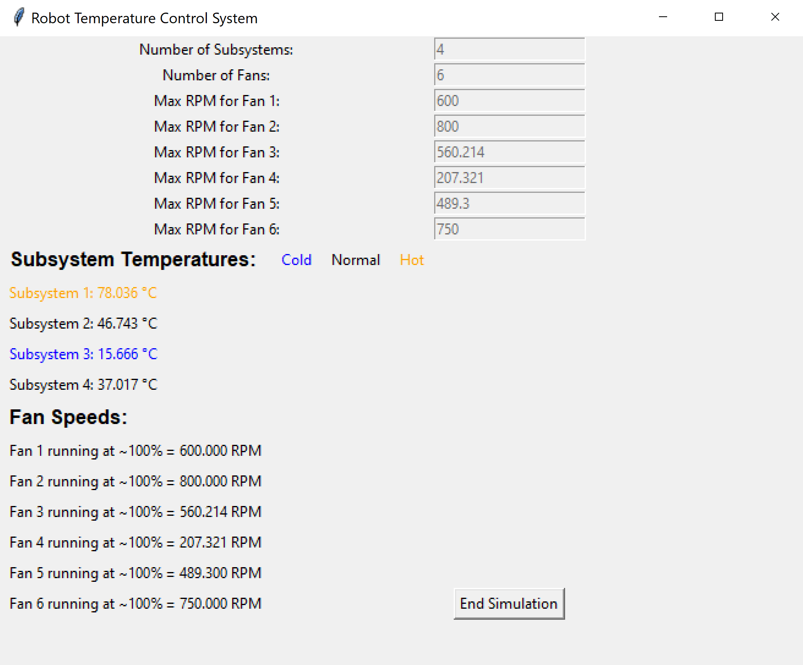

# Robot Temperature Control

## Overview
### Introduction
This is a little programming project that develops a robot with multiple subsystems and cooling fans. The robot dynamically adjusts the speed of its cooling fans based on the highest detected temperature. The system is designed using Object-Oriented Programming (OOP) in Python to ensure scalability and maintainability.

Before going into the development phase, I identified key goals that tie into prompt objective and to a real-world software engineer in manufacturing:
- Implement a clean and well-structured Object-Oriented Programming (OOP) design.
- Show that the robot accurately works for ranges of temperatures from -20°C to 85°C (using general range of temperatures that robot components could be at—specific temperature ranges are dependent on robot application and components).
- Design an intuitive and user-friendly interface for everyday users to easily run the application.
- Write tests to make the system more robust and reliable. 

### System Behavior & Expectations
- Temperatures and fan speeds are reported up to the third decimal. 
- The subsystem temperatures will be updated every 2 seconds.
- As mentioned in motivations, our goal is to see how the fans of the robot reacts across a broad range of subsystem temperatures. Thus, the user can expect the subsystem temperatures to be random values between 
-20°C and 85°C. The subsystem temperatures are randomly generated within the range of -20°C to 85°C and are updated every 2 seconds. The corresponding fan RPMs will be adjusted accordingly, providing a real-time response to the changing temperatures.
- System logs system state data in a csv file created after each program run in the `robot_data_log` directory. This includes: Timestamp, temperatures of all subsystems, and RPMs of all fans at that timestamp. The use of CSV files was chosen due to their human-readable format and their ease of integration with data analysis tools. In the context of robotics, this approach is particularly useful for analyzing performance over time and evaluating how the system behaves under varying conditions.

### Built With
- [Tkinter](https://docs.python.org/3/library/tkinter.html)

### How to Use
To run the main program:
1. Run `python simulation_ui.py`
2. The Tkinter UI will pop up asking for whole numbers to represent the number of subsystems and fans to include in the system. Once finished, slick "Configure" button.
3. Set the max RPM values of each fan. Once finished, click on the "Submit Max RPMs" button.

4. Observe how the fan speeds change as the temperature of each subsystem is automatically updated with a random float value between -20 and 85 degrees Celcius.

** Cold subsystem temperatures below 25°C are labeled blue. Hot subsystem temperatures above 75°C are labeled orange. Subsystems that fall in between this range are considered normal temperatures, which are colored black.
5. View the output data log csv file, named with the timestamp at which the log file was created. 

To run unit tests:
1. Run `python test_robot.py`
2. Observe results in console.

## Code Information
### Classes in [**robot_components.py**](robot_components.py)
- **Robot**: Manages the overall system, including subsystems and fans. This class validates the user input before using them to create Fan and Subsystem objects.
- **Fan**: Represents the cooling fans, managing their state and RPM adjustments.
- **Subsystem**: Represents individual subsystems, each with its current temperature data.

### Simulation in Tkinter
Within the [**simulation_ui.py**](simulation_ui.py), observe these functions and their objectives:
- `configure_robot()` → Captures and validates user input for number of subsystems and fans
- `process_fan_rpms()` → Validates fan max RPM inputs, initializes fans
- `start_simulation()` → Sets up simulation
- `display_simulation()` → Creates UI subsystem-state and fan-state reporting labels
- `update_simulation()` → Loops the updates
- `make_color_legend()` → Creates temperature colored legend in Tkinter
- `end_simulation()` → Creates button that closes the application

The main purpose of checking invalid inputs here is to have the UI Tkinter simulation react accordingly. For instance, when a user types in `-2` as input input to `Number of Subsystems`, a warning pop-up will notify them that the input is invalid.

### Testing
In [**test_robot.py**](test_robot.py), I wrote unit tests using Python's built-in `unittest` framework to validate the overall system. These tests include edge cases such as:
- User inputs with negative numbers → invalid input
- User inputs with letters or special characters → invalid input
- User input of 0 for number of fans and numer of subsystems → invalid input

These tests help ensure that the program handles unexpected inputs and performs as expected under different scenarios.

## Future Improvements
1. Introduce controlled and realistic temperature values rather than relying on randomly generated floating-point numbers. This would involve simulating more accurate temperature behavior based on real-world scenarios, such as environmental factors or the robot's internal processes. For instance, temperatures could be dynamically adjusted based on system performance or external conditions, providing a more realistic and meaningful representation of how the robot's subsystems operate.

Overall, I really enjoyed working on this project and it was a good learning experience! :D
